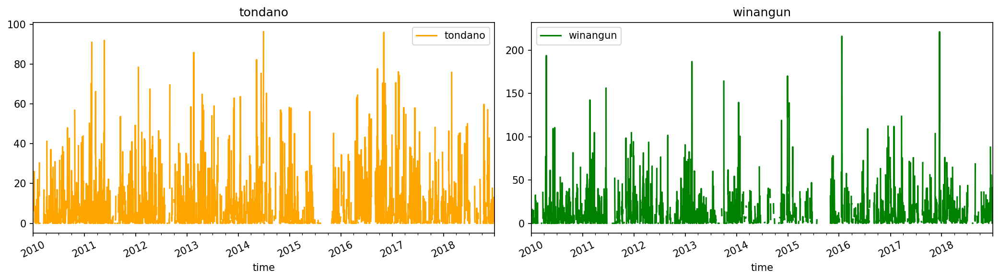
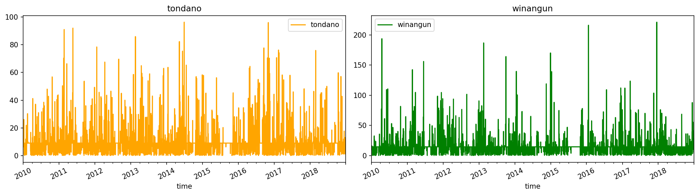
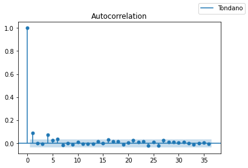
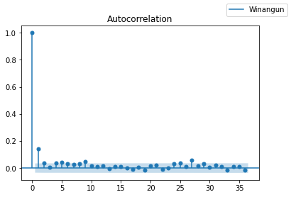
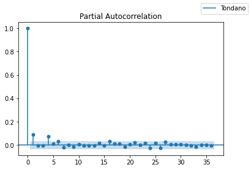
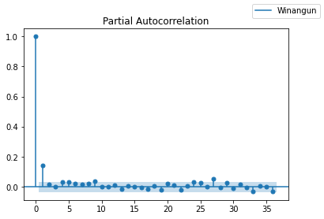
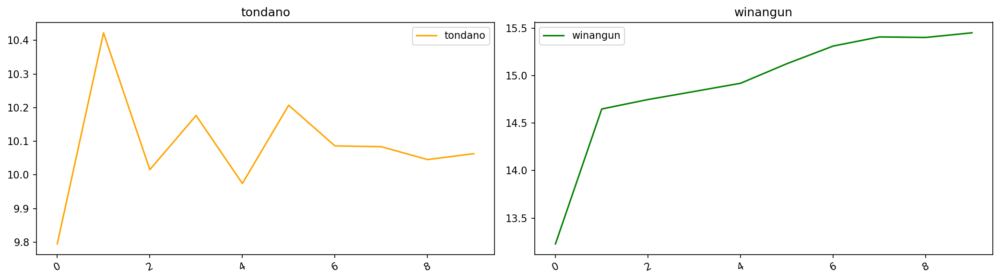

# forecast_var
Forecasting Time Series Using Vector Autoregression (VAR)

```python
#!/usr/bin/env python3
# -*- coding: utf-8 -*-

"""
Created on Thu Jun 24 17:17:54 2021

@author: Arjuna Panji Prakarsa
"""

# install the libraries
import sys
!{sys.executable} -m pip install numpy 
!{sys.executable} -m pip install matplotlib 
!{sys.executable} -m pip install pandas
!{sys.executable} -m pip install statsmodels
!{sys.executable} -m pip install sklearn

# import the libraries
import numpy as np
import pandas as pd
import matplotlib as mpl
import matplotlib.pyplot as plt
import statsmodels.api as sm
from statsmodels.tsa.stattools import adfuller
from statsmodels.tsa.api import VAR
from statsmodels.graphics.tsaplots import plot_acf, plot_pacf
from sklearn.metrics import mean_squared_error
from sklearn.metrics import mean_absolute_error
from sklearn.metrics import r2_score
```

    Defaulting to user installation because normal site-packages is not writeable
    Requirement already satisfied: numpy in /home/arjuna/.local/lib/python3.6/site-packages (1.19.5)
    Defaulting to user installation because normal site-packages is not writeable
    Requirement already satisfied: matplotlib in /home/arjuna/.local/lib/python3.6/site-packages (3.3.3)
    Requirement already satisfied: pyparsing!=2.0.4,!=2.1.2,!=2.1.6,>=2.0.3 in /home/arjuna/.local/lib/python3.6/site-packages (from matplotlib) (2.4.7)
    Requirement already satisfied: pillow>=6.2.0 in /home/arjuna/.local/lib/python3.6/site-packages (from matplotlib) (8.1.0)
    Requirement already satisfied: numpy>=1.15 in /home/arjuna/.local/lib/python3.6/site-packages (from matplotlib) (1.19.5)
    Requirement already satisfied: cycler>=0.10 in /home/arjuna/.local/lib/python3.6/site-packages (from matplotlib) (0.10.0)
    Requirement already satisfied: kiwisolver>=1.0.1 in /home/arjuna/.local/lib/python3.6/site-packages (from matplotlib) (1.3.1)
    Requirement already satisfied: python-dateutil>=2.1 in /home/arjuna/.local/lib/python3.6/site-packages (from matplotlib) (2.8.1)
    Requirement already satisfied: six in /usr/lib/python3/dist-packages (from cycler>=0.10->matplotlib) (1.11.0)
    Defaulting to user installation because normal site-packages is not writeable
    Requirement already satisfied: pandas in /home/arjuna/.local/lib/python3.6/site-packages (1.1.5)
    Requirement already satisfied: pytz>=2017.2 in /usr/lib/python3/dist-packages (from pandas) (2018.3)
    Requirement already satisfied: python-dateutil>=2.7.3 in /home/arjuna/.local/lib/python3.6/site-packages (from pandas) (2.8.1)
    Requirement already satisfied: numpy>=1.15.4 in /home/arjuna/.local/lib/python3.6/site-packages (from pandas) (1.19.5)
    Requirement already satisfied: six>=1.5 in /usr/lib/python3/dist-packages (from python-dateutil>=2.7.3->pandas) (1.11.0)
    Defaulting to user installation because normal site-packages is not writeable
    Requirement already satisfied: statsmodels in /home/arjuna/.local/lib/python3.6/site-packages (0.12.2)
    Requirement already satisfied: patsy>=0.5 in /home/arjuna/.local/lib/python3.6/site-packages (from statsmodels) (0.5.1)
    Requirement already satisfied: scipy>=1.1 in /home/arjuna/.local/lib/python3.6/site-packages (from statsmodels) (1.5.4)
    Requirement already satisfied: pandas>=0.21 in /home/arjuna/.local/lib/python3.6/site-packages (from statsmodels) (1.1.5)
    Requirement already satisfied: numpy>=1.15 in /home/arjuna/.local/lib/python3.6/site-packages (from statsmodels) (1.19.5)
    Requirement already satisfied: python-dateutil>=2.7.3 in /home/arjuna/.local/lib/python3.6/site-packages (from pandas>=0.21->statsmodels) (2.8.1)
    Requirement already satisfied: pytz>=2017.2 in /usr/lib/python3/dist-packages (from pandas>=0.21->statsmodels) (2018.3)
    Requirement already satisfied: six in /usr/lib/python3/dist-packages (from patsy>=0.5->statsmodels) (1.11.0)
    Defaulting to user installation because normal site-packages is not writeable
    Requirement already satisfied: sklearn in /home/arjuna/.local/lib/python3.6/site-packages (0.0)
    Requirement already satisfied: scikit-learn in /home/arjuna/.local/lib/python3.6/site-packages (from sklearn) (0.24.2)
    Requirement already satisfied: joblib>=0.11 in /home/arjuna/.local/lib/python3.6/site-packages (from scikit-learn->sklearn) (1.0.0)
    Requirement already satisfied: numpy>=1.13.3 in /home/arjuna/.local/lib/python3.6/site-packages (from scikit-learn->sklearn) (1.19.5)
    Requirement already satisfied: scipy>=0.19.1 in /home/arjuna/.local/lib/python3.6/site-packages (from scikit-learn->sklearn) (1.5.4)
    Requirement already satisfied: threadpoolctl>=2.0.0 in /home/arjuna/.local/lib/python3.6/site-packages (from scikit-learn->sklearn) (2.1.0)


```python
color_list = ["orange", "green"]

# function to show plot
def Visualize(data):
    features = list(df.select_dtypes(include=[np.number]).columns.values)
    feature_size = len(features)
    fig, axes = plt.subplots(
        nrows = int(np.ceil(feature_size/2)), 
        ncols = 2, figsize = (14, feature_size * 2), 
        dpi = 150,
        facecolor = "w",
        edgecolor = "k"
    )
    for i in range(feature_size):
        key = features[i]
        c = color_list[i % (len(color_list))]
        t_data = data[key]
        t_data.head()
        ax = t_data.plot(
            ax = axes[i % 2],
            color = c ,
            title = "{}".format(key),
            rot = 25
        )
        ax.legend([key])
    plt.tight_layout()
```


```python
# MAPE
def mean_absolute_percentage_error(y_true, y_pred):
    return np.mean(np.abs((y_pred - y_true) / y_true)) * 100

# SMAPE
def symmetric_mean_absolute_percentage_error(y_true, y_pred):
    return 2.0 * np.mean(np.abs(y_pred - y_true) / (np.abs(y_pred) + np.abs(y_true))) * 100
```


```python
# import dataset
df = pd.read_csv('dataset_tondano_winangun.csv', index_col=0, parse_dates=True)
df
```


<div>
<style scoped>
    .dataframe tbody tr th:only-of-type {
        vertical-align: middle;
    }

    .dataframe tbody tr th {
        vertical-align: top;
    }

    .dataframe thead th {
        text-align: right;
    }
</style>
<table border="1" class="dataframe">
  <thead>
    <tr style="text-align: right;">
      <th></th>
      <th>tondano</th>
      <th>winangun</th>
    </tr>
    <tr>
      <th>time</th>
      <th></th>
      <th></th>
    </tr>
  </thead>
  <tbody>
    <tr>
      <th>2010-01-01</th>
      <td>0.0</td>
      <td>0.0</td>
    </tr>
    <tr>
      <th>2010-01-02</th>
      <td>NaN</td>
      <td>0.0</td>
    </tr>
    <tr>
      <th>2010-01-03</th>
      <td>NaN</td>
      <td>NaN</td>
    </tr>
    <tr>
      <th>2010-01-04</th>
      <td>NaN</td>
      <td>NaN</td>
    </tr>
    <tr>
      <th>2010-01-05</th>
      <td>NaN</td>
      <td>NaN</td>
    </tr>
    <tr>
      <th>...</th>
      <td>...</td>
      <td>...</td>
    </tr>
    <tr>
      <th>2018-12-27</th>
      <td>5.1</td>
      <td>0.0</td>
    </tr>
    <tr>
      <th>2018-12-28</th>
      <td>11.0</td>
      <td>28.0</td>
    </tr>
    <tr>
      <th>2018-12-29</th>
      <td>13.2</td>
      <td>6.0</td>
    </tr>
    <tr>
      <th>2018-12-30</th>
      <td>1.0</td>
      <td>8.5</td>
    </tr>
    <tr>
      <th>2018-12-31</th>
      <td>NaN</td>
      <td>4.0</td>
    </tr>
  </tbody>
</table>
<p>3287 rows × 2 columns</p>
</div>


```python
Visualize(df)
plt.savefig('data_preprocessing.png')
```


    

    


```python
# cleaning dataset
# change any zero value to NaN and fill NaN with mean value from dataframe
df=df.mask(df==0).fillna(df.mean())

#df = df.dropna() # remove empty Value
#df = df.fillna(0.1) # change NaN to 0.1
#df = df[(df.T != 0).any()] # remove all zero value

# show output
df
```


<div>
<style scoped>
    .dataframe tbody tr th:only-of-type {
        vertical-align: middle;
    }

    .dataframe tbody tr th {
        vertical-align: top;
    }

    .dataframe thead th {
        text-align: right;
    }
</style>
<table border="1" class="dataframe">
  <thead>
    <tr style="text-align: right;">
      <th></th>
      <th>tondano</th>
      <th>winangun</th>
    </tr>
    <tr>
      <th>time</th>
      <th></th>
      <th></th>
    </tr>
  </thead>
  <tbody>
    <tr>
      <th>2010-01-01</th>
      <td>9.051323</td>
      <td>14.46611</td>
    </tr>
    <tr>
      <th>2010-01-02</th>
      <td>9.051323</td>
      <td>14.46611</td>
    </tr>
    <tr>
      <th>2010-01-03</th>
      <td>9.051323</td>
      <td>14.46611</td>
    </tr>
    <tr>
      <th>2010-01-04</th>
      <td>9.051323</td>
      <td>14.46611</td>
    </tr>
    <tr>
      <th>2010-01-05</th>
      <td>9.051323</td>
      <td>14.46611</td>
    </tr>
    <tr>
      <th>...</th>
      <td>...</td>
      <td>...</td>
    </tr>
    <tr>
      <th>2018-12-27</th>
      <td>5.100000</td>
      <td>14.46611</td>
    </tr>
    <tr>
      <th>2018-12-28</th>
      <td>11.000000</td>
      <td>28.00000</td>
    </tr>
    <tr>
      <th>2018-12-29</th>
      <td>13.200000</td>
      <td>6.00000</td>
    </tr>
    <tr>
      <th>2018-12-30</th>
      <td>1.000000</td>
      <td>8.50000</td>
    </tr>
    <tr>
      <th>2018-12-31</th>
      <td>9.051323</td>
      <td>4.00000</td>
    </tr>
  </tbody>
</table>
<p>3287 rows × 2 columns</p>
</div>


```python
Visualize(df)
plt.savefig('data_postprocessing.png')
```


    

    


```python
# ACF Tondano and Winangun
acf_tondano = plot_acf(df['tondano']).legend(['Tondano'])
acf_winangun = plot_acf(df['winangun']).legend(['Winangun'])
plt.show()
```


    

    


    

    


```python
# PACF Tondano and Winangun
pacf_tondano = plot_pacf(df['tondano']).legend(['Tondano'])
pacf_winangun = plot_pacf(df['winangun']).legend(['Winangun'])
plt.show()
```


    

    


    

    


```python
# check is the series stationary or not using ADF
for i in range(len(df.columns)):
    result = adfuller(df[df.columns[i]])
    print(f"Test Statistics: {result[0]}")
    print(f"P-Value: {result[1]}")
    print(f"Critical Values: {result[4]}")
    
    if result[1] > 0.05:
        print("{}: Series is not Stationary\n".format(df.columns[i]))
    else:
        print("{}: Series is Stationary\n".format(df.columns[i]))
```

    Test Statistics: -20.934864859113997
    P-Value: 0.0
    Critical Values: {'1%': -3.4323446429448277, '5%': -2.862421314897806, '10%': -2.567239142377757}
    tondano: Series is Stationary
    
    Test Statistics: -16.400293270457425
    P-Value: 2.642188549410099e-29
    Critical Values: {'1%': -3.4323464698589774, '5%': -2.8624221218326817, '10%': -2.5672395719722254}
    winangun: Series is Stationary
    


```python
# make train data and test data
df_train = df[:int(0.9*(len(df)))]
df_test = df[int(0.9*(len(df))):]
```


```python
# show dataframe for training
df_train
```


<div>
<style scoped>
    .dataframe tbody tr th:only-of-type {
        vertical-align: middle;
    }

    .dataframe tbody tr th {
        vertical-align: top;
    }

    .dataframe thead th {
        text-align: right;
    }
</style>
<table border="1" class="dataframe">
  <thead>
    <tr style="text-align: right;">
      <th></th>
      <th>tondano</th>
      <th>winangun</th>
    </tr>
    <tr>
      <th>time</th>
      <th></th>
      <th></th>
    </tr>
  </thead>
  <tbody>
    <tr>
      <th>2010-01-01</th>
      <td>9.051323</td>
      <td>14.46611</td>
    </tr>
    <tr>
      <th>2010-01-02</th>
      <td>9.051323</td>
      <td>14.46611</td>
    </tr>
    <tr>
      <th>2010-01-03</th>
      <td>9.051323</td>
      <td>14.46611</td>
    </tr>
    <tr>
      <th>2010-01-04</th>
      <td>9.051323</td>
      <td>14.46611</td>
    </tr>
    <tr>
      <th>2010-01-05</th>
      <td>9.051323</td>
      <td>14.46611</td>
    </tr>
    <tr>
      <th>...</th>
      <td>...</td>
      <td>...</td>
    </tr>
    <tr>
      <th>2018-02-01</th>
      <td>9.051323</td>
      <td>1.50000</td>
    </tr>
    <tr>
      <th>2018-02-02</th>
      <td>9.051323</td>
      <td>14.46611</td>
    </tr>
    <tr>
      <th>2018-02-03</th>
      <td>10.100000</td>
      <td>2.30000</td>
    </tr>
    <tr>
      <th>2018-02-04</th>
      <td>9.051323</td>
      <td>14.46611</td>
    </tr>
    <tr>
      <th>2018-02-05</th>
      <td>9.051323</td>
      <td>4.50000</td>
    </tr>
  </tbody>
</table>
<p>2958 rows × 2 columns</p>
</div>


```python
# show dataframe for test
df_test
```


<div>
<style scoped>
    .dataframe tbody tr th:only-of-type {
        vertical-align: middle;
    }

    .dataframe tbody tr th {
        vertical-align: top;
    }

    .dataframe thead th {
        text-align: right;
    }
</style>
<table border="1" class="dataframe">
  <thead>
    <tr style="text-align: right;">
      <th></th>
      <th>tondano</th>
      <th>winangun</th>
    </tr>
    <tr>
      <th>time</th>
      <th></th>
      <th></th>
    </tr>
  </thead>
  <tbody>
    <tr>
      <th>2018-02-06</th>
      <td>26.800000</td>
      <td>70.20000</td>
    </tr>
    <tr>
      <th>2018-02-07</th>
      <td>37.300000</td>
      <td>60.00000</td>
    </tr>
    <tr>
      <th>2018-02-08</th>
      <td>46.400000</td>
      <td>52.40000</td>
    </tr>
    <tr>
      <th>2018-02-09</th>
      <td>10.100000</td>
      <td>5.10000</td>
    </tr>
    <tr>
      <th>2018-02-10</th>
      <td>3.900000</td>
      <td>52.40000</td>
    </tr>
    <tr>
      <th>...</th>
      <td>...</td>
      <td>...</td>
    </tr>
    <tr>
      <th>2018-12-27</th>
      <td>5.100000</td>
      <td>14.46611</td>
    </tr>
    <tr>
      <th>2018-12-28</th>
      <td>11.000000</td>
      <td>28.00000</td>
    </tr>
    <tr>
      <th>2018-12-29</th>
      <td>13.200000</td>
      <td>6.00000</td>
    </tr>
    <tr>
      <th>2018-12-30</th>
      <td>1.000000</td>
      <td>8.50000</td>
    </tr>
    <tr>
      <th>2018-12-31</th>
      <td>9.051323</td>
      <td>4.00000</td>
    </tr>
  </tbody>
</table>
<p>329 rows × 2 columns</p>
</div>


```python
# try 10 lags
lags = 10
model = VAR(df_train, freq="D")
for i in range(lags):
    results = model.fit(i+1)
    print("Order = ", i+1)
    print("AIC = ", results.aic)
    print("BIC = ", results.bic)
```

    Order =  1
    AIC =  10.371509070085054
    BIC =  10.383667197619419
    Order =  2
    AIC =  10.372746630849313
    BIC =  10.39301588755455
    Order =  3
    AIC =  10.374459972282269
    BIC =  10.402844931679143
    Order =  4
    AIC =  10.36874701339293
    BIC =  10.40525225318157
    Order =  5
    AIC =  10.3676047465038
    BIC =  10.412234848568941
    Order =  6
    AIC =  10.367422499612609
    BIC =  10.420182050028846
    Order =  7
    AIC =  10.367867496645948
    BIC =  10.428761085682982
    Order =  8
    AIC =  10.370731146524244
    BIC =  10.43976336865216
    Order =  9
    AIC =  10.37194707955293
    BIC =  10.449122533447463
    Order =  10
    AIC =  10.374723272205472
    BIC =  10.460046560753296


```python
model.select_order(lags).summary()
```


<table class="simpletable">
<caption>VAR Order Selection (* highlights the minimums)</caption>
<tr>
   <td></td>      <th>AIC</th>         <th>BIC</th>         <th>FPE</th>        <th>HQIC</th>    
</tr>
<tr>
  <th>0</th>  <td>     10.40</td>  <td>     10.41</td>  <td> 3.301e+04</td>  <td>     10.41</td> 
</tr>
<tr>
  <th>1</th>  <td>     10.38</td>  <td>     10.39*</td> <td> 3.210e+04</td>  <td>     10.38*</td>
</tr>
<tr>
  <th>2</th>  <td>     10.38</td>  <td>     10.40</td>  <td> 3.212e+04</td>  <td>     10.38</td> 
</tr>
<tr>
  <th>3</th>  <td>     10.38</td>  <td>     10.41</td>  <td> 3.215e+04</td>  <td>     10.39</td> 
</tr>
<tr>
  <th>4</th>  <td>     10.37</td>  <td>     10.41</td>  <td> 3.195e+04</td>  <td>     10.38</td> 
</tr>
<tr>
  <th>5</th>  <td>     10.37</td>  <td>     10.41</td>  <td> 3.189e+04</td>  <td>     10.39</td> 
</tr>
<tr>
  <th>6</th>  <td>     10.37*</td> <td>     10.42</td>  <td> 3.186e+04*</td> <td>     10.39</td> 
</tr>
<tr>
  <th>7</th>  <td>     10.37</td>  <td>     10.43</td>  <td> 3.188e+04</td>  <td>     10.39</td> 
</tr>
<tr>
  <th>8</th>  <td>     10.37</td>  <td>     10.44</td>  <td> 3.196e+04</td>  <td>     10.40</td> 
</tr>
<tr>
  <th>9</th>  <td>     10.37</td>  <td>     10.45</td>  <td> 3.197e+04</td>  <td>     10.40</td> 
</tr>
<tr>
  <th>10</th> <td>     10.37</td>  <td>     10.46</td>  <td> 3.204e+04</td>  <td>     10.41</td> 
</tr>
</table>


```python
# from the result above, the lowest BIC is from the lag 1
model = VAR(df_train, freq="D")
results = model.fit(6)
results.summary()
```


      Summary of Regression Results   
    ==================================
    Model:                         VAR
    Method:                        OLS
    Date:           Fri, 25, Jun, 2021
    Time:                     00:42:32
    --------------------------------------------------------------------
    No. of Equations:         2.00000    BIC:                    10.4202
    Nobs:                     2952.00    HQIC:                   10.3864
    Log likelihood:          -23653.7    FPE:                    31806.4
    AIC:                      10.3674    Det(Omega_mle):         31528.1
    --------------------------------------------------------------------
    Results for equation tondano
    ==============================================================================
                     coefficient       std. error           t-stat            prob
    ------------------------------------------------------------------------------
    const               8.417658         0.552821           15.227           0.000
    L1.tondano          0.091064         0.018773            4.851           0.000
    L1.winangun         0.008903         0.011878            0.750           0.454
    L2.tondano         -0.006941         0.018845           -0.368           0.713
    L2.winangun        -0.021093         0.011975           -1.761           0.078
    L3.tondano         -0.009591         0.018801           -0.510           0.610
    L3.winangun        -0.002720         0.011968           -0.227           0.820
    L4.tondano          0.080024         0.018818            4.252           0.000
    L4.winangun         0.000872         0.011957            0.073           0.942
    L5.tondano          0.009210         0.018883            0.488           0.626
    L5.winangun         0.002372         0.011957            0.198           0.843
    L6.tondano          0.041597         0.018831            2.209           0.027
    L6.winangun        -0.017106         0.011848           -1.444           0.149
    ==============================================================================
    
    Results for equation winangun
    ==============================================================================
                     coefficient       std. error           t-stat            prob
    ------------------------------------------------------------------------------
    const              12.666547         0.874321           14.487           0.000
    L1.tondano          0.031018         0.029691            1.045           0.296
    L1.winangun         0.143953         0.018785            7.663           0.000
    L2.tondano         -0.029266         0.029804           -0.982           0.326
    L2.winangun         0.013126         0.018939            0.693           0.488
    L3.tondano         -0.069961         0.029735           -2.353           0.019
    L3.winangun         0.000606         0.018929            0.032           0.974
    L4.tondano          0.093412         0.029762            3.139           0.002
    L4.winangun         0.016642         0.018910            0.880           0.379
    L5.tondano         -0.079044         0.029864           -2.647           0.008
    L5.winangun         0.044035         0.018910            2.329           0.020
    L6.tondano         -0.036954         0.029782           -1.241           0.215
    L6.winangun         0.023372         0.018739            1.247           0.212
    ==============================================================================
    
    Correlation matrix of residuals
                 tondano  winangun
    tondano     1.000000  0.192747
    winangun    0.192747  1.000000
    


```python
# using lag 6
lag = results.k_ar
print("Lag:",lag)
```

    Lag: 6


```python
# result for test and predict
y_test = df_test
y_predict = results.forecast(df_train.values[-lag:], steps=df_test.shape[0])

mape = mean_absolute_percentage_error(y_test, y_predict)
print("MAPE:",mape,"\n")

smape = symmetric_mean_absolute_percentage_error(y_test, y_predict)
print("SMAPE:",smape,"\n")

mae = mean_absolute_error(y_test,y_predict)
print("MAE :",mae)

mse = mean_squared_error(y_test,y_predict)
print("MSE :",mse)

rmse = np.sqrt(mean_squared_error(y_test,y_predict))
print("RMSE:",rmse)

print("R2  :",r2_score(y_test,y_predict))
```

    MAPE: tondano     217.759824
    winangun    326.897511
    dtype: float64 
    
    SMAPE: tondano     46.804787
    winangun    48.048431
    dtype: float64 
    
    MAE : 5.673479941059014
    MSE : 111.03055153156832
    RMSE: 10.537103564621937
    R2  : -0.0087994079963995


```python
# generate forecast for next 10 days
data = np.array(results.forecast(df_train.values[-lag:], steps=10))
forecast_output = pd.DataFrame(data=data, columns=['tondano', 'winangun'])
forecast_output['days'] = pd.DataFrame(data=[1,2,3,4,5,6,7,8,9,10])
forecast_output = forecast_output[['days', 'tondano', 'winangun']]
print("10 Days Forecasts:\n=============================")
print(forecast_output.to_string(index=False))
```

    10 Days Forecasts:
    =============================
     days    tondano   winangun
        1   9.794931  13.227645
        2  10.422255  14.648090
        3  10.015569  14.747704
        4  10.176484  14.832652
        5   9.974478  14.918998
        6  10.207041  15.124936
        7  10.086187  15.310764
        8  10.083819  15.406841
        9  10.045560  15.401374
       10  10.063046  15.450258


```python
Visualize(forecast_output)
plt.savefig('forecast_output.png')
```


    

    


```python
# write forecast output to csv
forecast_output.to_csv(r'forecast_output.csv', index = False)
```


```python

```
